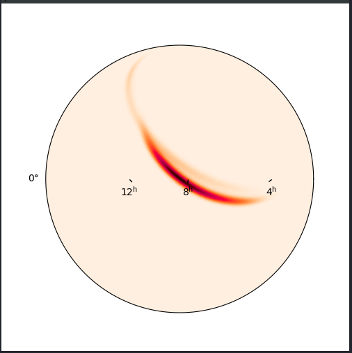
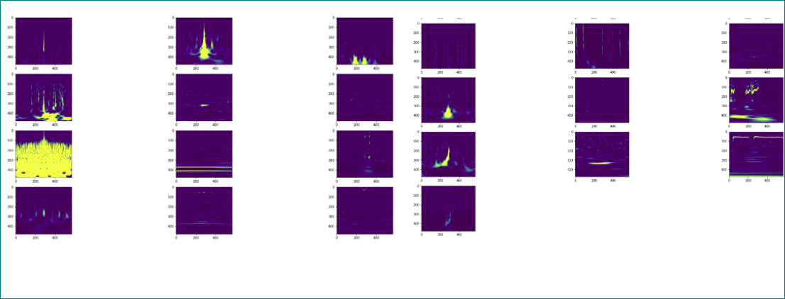
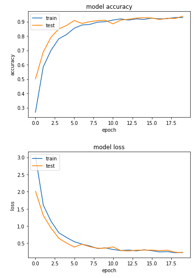
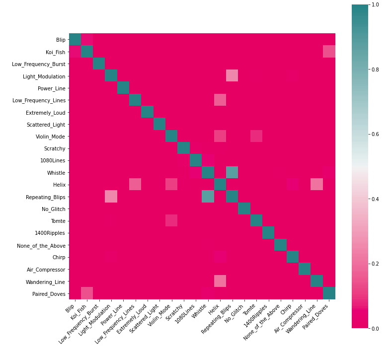
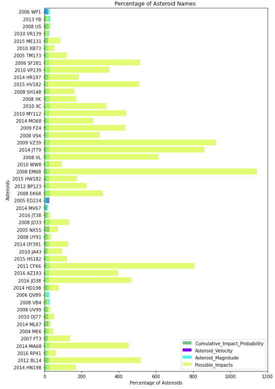

# nasa_gw_as

# Abstract

We are trying to create a prediction model of gravitational waves and visualisation based on its characteristics to find wormholes, along with live asteroid tracking with a prediction model for impacting the earth. 

# How We Addressed This Challenge

We aimed to solve two different problems related to this challenge:

    Detecting and proving the existence of possible interstellar wormholes
    Live tracking asteroids and predicting when they will hit earth

#### We had the following goals:

    * To increase the accuracy of prediction of gravitational waves and asteroid alert.
    * Try to achieve a live asteroid system where we can surface the names of asteroids that could collide with earth from the asteroid visualization model.
    * Creating a GUI to live track the flagged asteroids
    * Identifying wormholes by finding similar gravitational energy signatures in different regions of space.
    * To make APIs available to users(amateur astronomers, scientists, etc) for them to access this data and visualize them. 
    
    
# How We Developed This Project
### Wormholes

Wormholes are solutions to the Einstein field equations for gravity that act as "tunnels," connecting points in space-time in such a way that the trip between the points through the wormhole could take much less time than the trip through normal space.

Wormholes are possible, according to Einstein's general theory of relativity, but nobody has ever spotted one. They are expected to require extreme gravitational conditions, such as those present at supermassive black holes like Sagittarius A* to form and are most likely to be found near one.

We find wormholes really interesting. If it was proved that wormholes exist, it would open up new interesting possibilities like space and time travel. We are excited to make that happen. This is our motivation and inspiration.

### Asteroid tracking

Asteroids are small rocky bodies that orbit the sun. They are mostly found in the asteroid belt between Mars and Jupiter. Occasionally, asteroids' orbital paths are influenced by the gravitational tug of planets, which cause their paths to alter. It is believed that most extinction events in the history of our planet have been caused by asteroids colliding with earth. Hence, it is in our interest to detect, catalogue and track asteroids that may impact earth in the future.

### Wormhole Identification

Wormholes are expected to form near supermassive bodies. If a wormhole does exist at supermassive blackholes like Sagittarius A*, stars at the other end of the passage would be influenced by the gravity. The star should feel the gravitational influence of the wormhole that’s on the other side due to the gravitational flux going through the wormhole. We used gravitational wave data from NASA and LIGO to plot a q-transform of gravitational wave sources, which visually represents the frequency or energy of a gravitational source over time in a spectrogram. We then use this as the unique gravitational energy signature of the source. Each source has a unique gravitational energy signature, and if the gravitational energy signature of one source is detected at the other source, it probably means that there is a wormhole connecting them. This is what we are trying to identify.

This is a gravitation localization event. Using a program we wrote, we generated the above image showing the exact location of a gravitational wave source (a supernova) in the sky.

### Model Training

We built, trained, evaluated and inspected a convolutional neural network on the below datasets. The CNN classifies spectrograms representing different types of glitches in gravitational waves into 22 classes like blip, koi - fish, chirp etc.

By classifying the data into similar classes, we can better identify identical or extremely similar gravitational energy signatures and find wormholes.

This classified data, along with the model, exposed as an API can help identify wormholes.

### Results

We have achieved an accuracy of 93% in classifying different types of gravitational waves. 

We have not identified extremely similar gravitational energy signatures yet, and we are working on it.

These are the different types of glitches in gravitational waves. They represent each of the below 22 classes:

Blip

Koi_Fish

Low_Frequency_Burst

Light_Modulation

Power_Line

Low_Frequency_Lines

Extremely_Loud

Scattered_Light

Violin_Mode

Scratchy

1080Lines

Whistle

Helix

Repeating_Blips

No_Glitch

Tomte

1400Ripples

None_of_the_Above (probably interference in the detector)

Chirp

Air_Compressor

Wandering_Line

Paired_Doves

# Asteroid prediction for impact on earth

We have created a model to predict whether an asteroid will hit earth based on past data like its orbital information. Tracking of these objects will predict when it will hit earth. To make tracking easier, we developed a GUI to show a FITS image of where exactly the asteroid is along with its coordinate.

### Model Training

We built, trained, evaluated and inspected a neural network on the below datasets. The neural network will predict in exactly which year a particular asteroid has the highest probability of hitting earth and what that cumulative impact probability is. This asteroid can then be tracked in the GUI we developed for it.

### Results

This particular model has an accuracy of 99.7%

# Asteroid tracking GUI

We have developed a GUI that takes the just the current coordinates of of the asteroids flagged as being in danger of hitting earth and tracks it live through space. It can show you where exactly the selected asteroid is now through a series of FITS images. These images are extracted, through an external python library called photometry pipeline, from NASAs SkyView Virtual Obesevatory. Flexible Image Transport System (FITS) is an open standard defining a digital file format useful for storage, transmission and processing of data. FITS is the most commonly used digital file format in astronomy, which makes our application universal.

Below is a demo of our GUI:

 https://drive.google.com/file/d/1o_d_8ZcX4o0GGcwVEu8oUxWsr9sMsIbz/v
 
# How We Used Space Agency Data in This Project
Wormhole Identification
### Data

LIGO(Laser Interferometer Gravitational-wave Observatory) is the world's largest gravitational wave observatory. It collects information about gravitational waves from large gravitational events, and makes it available for anyone to use here.

We also used NASA’s data on Black Hole - Neutron Star Binary Mergers here

We used this to plot a q-transform of the data, which visually represents the frequency or energy of a gravitational source over time in a spectrogram. We then tag this as the unique gravitational energy signature of the source. If the same plot is seen elsewhere, it could indicate the presence of a wormhole in that area.

# Asteroid prediction for impact on earth
### Data

The asteroid orbit and impact risk data was collected by NASA's Near Earth Object Program at the Jet Propulsion Laboratory (California Institute of Technology). Two csv files are used for visualization of the most probable asteroid impact. Orbits.csv contains data about all the near earth asteroids and their obits. Impacts.csv contains the below data which indicate possible asteroid impacts. 

Object Name

Period Start

Period End

Possible Impacts

Cumulative Impact Probability

Asteroid Velocity

Asteroid Magnitude

Asteroid Diameter (km)

Cumulative Palermo Scale

Maximum Palermo Scale

Maximum Torino Scale

[Project Demo](https://docs.google.com/presentation/d/1MvLcwRzVAMRQn_MwY1meMN1Q4O5e0emofX1jk7KJIaM/edit#slide=id.g9dfcf704d1_7_1
)

[Demo of asteroid tracker](https://drive.google.com/file/d/1o_d_8ZcX4o0GGcwVEu8oUxWsr9sMsIbz/view)

[full documentation](https://docs.google.com/document/d/1i8vdxPo2N_16du58171Ix6f-mDP8MaTaW7TolTwT2lg/edit?usp=sharing)

# Data & Resources

[Link1](http://www.buffalo.edu/news/releases/2019/10/035.html)

[Link2](https://heasarc.gsfc.nasa.gov/vo/summary/python.html)

[Link3](https://skyview.gsfc.nasa.gov/current/cgi/titlepage.pl)

[Link4](https://catalog.data.gov/nl/dataset/black-hole-neutron-star-binary-mergers)

[Link5](https://bgr.com/2020/09/01/wormholes-time-travel-theory/)

[Link6](https://www.nasa.gov/sites/default/files/atoms/files/black_hole_math.pdf)

[Link7](https://data.nasa.gov/widgets/s95g-ax2v)

[Link8](https://www.gw-openscience.org/data/)
